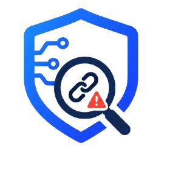
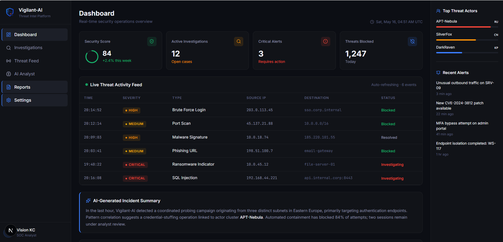
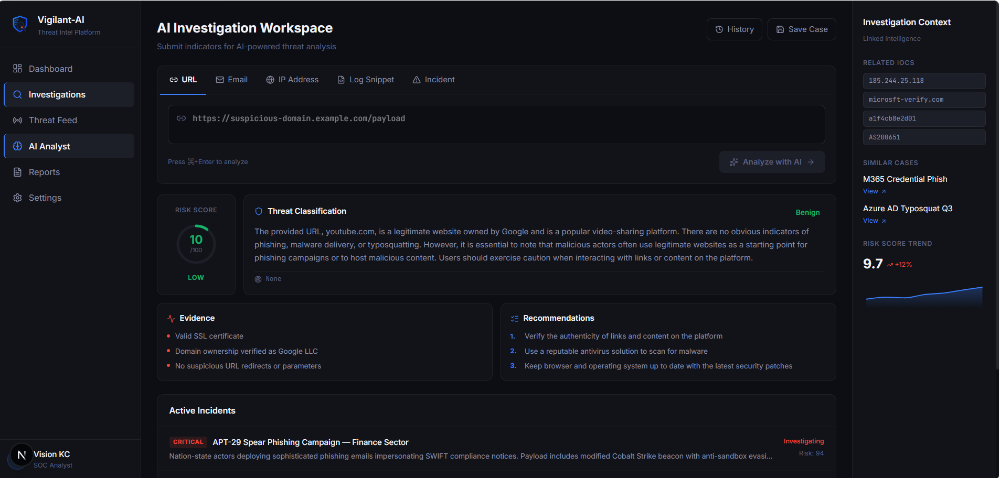

# Vigilant-AI

<p align="center">
  
</p>

<p align="center">
  <strong>Advanced AI-Powered Cybersecurity Operations Platform</strong>
</p>

<p align="center">
  
  
  
  
  
  
</p>

---

## Overview

**Vigilant-AI** is an enterprise-grade cybersecurity simulation and analysis platform. It provides Security Operations Center (SOC) analysts with a sophisticated, AI-driven interface for rapid threat investigation and incident response. 

By integrating high-performance Large Language Models via the **Groq API**, Vigilant-AI can analyze complex security indicators—such as suspicious URLs, phishing emails, and system logs—in milliseconds, providing structured intelligence and actionable recommendations.

## Core Features

-   🛡️ **AI-Powered Analysis**: Specialized modules for URL, Email, IP, and Log investigation.
-   📊 **SOC Dashboard**: Real-time metrics, threat volume charts, and active incident tracking.
-   📡 **Live Threat Feed**: Simulated global intelligence stream with attribution and severity scoring.
-   🧪 **SOC Simulation**: High-fidelity seed data system providing a realistic operational environment.
-   ⚡ **Groq Acceleration**: Sub-second inference for deep security investigations using Llama 3.3.
-   🎨 **Premium UI/UX**: Modern, dark-mode optimized interface designed for high-pressure security environments.

## Screenshots

| Dashboard Overview | AI Investigation Workspace |
| :---: | :---: |
|  |  |

## Tech Stack

-   **Frontend**: Next.js 15, React, Lucide Icons, Recharts
-   **Styling**: Modern CSS with CSS Variables (Design Tokens)
-   **AI Engine**: Groq Cloud SDK (Llama-3.3-70b-versatile)
-   **Language**: TypeScript
-   **Deployment**: Vercel

## Installation Guide

### Prerequisites

-   Node.js 18+ 
-   A Groq API Key (Get one at [console.groq.com](https://console.groq.com))

### Setup

1.  **Clone the repository**:
    ```bash
    git clone https://github.com/visionxstack/Vigilant-AI.git
    cd Vigilant-AI
    ```

2.  **Install dependencies**:
    ```bash
    npm install
    ```

3.  **Configure environment variables**:
    Create a `.env` file in the root directory:
    ```env
    GROQ_API_KEY=your_api_key_here
    ```

4.  **Run the application**:
    ```bash
    npm run dev
    ```
    Open [http://localhost:3000](http://localhost:3000) in your browser.

## How It Works

Vigilant-AI utilizes a secure, server-side architecture to handle AI-driven investigations. When an analyst submits an indicator, the platform:
1.  Detects the input type and prepares a security-focused prompt.
2.  Communicates with the Groq API via a secure backend route.
3.  Parses the AI's structured response into a standardized security report.
4.  Updates the interactive dashboard widgets with the latest findings.

## Folder Structure

```text
Vigilant-AI/
├── app/            # Next.js pages and API routes
├── components/     # UI components and modules
├── data/           # SOC simulation seed data
├── lib/            # AI configuration and prompt logic
├── public/         # Branding and static assets
└── styles/         # Global design system
```

## Deployment

This project is optimized for deployment on the **Vercel Platform**. 

1.  Push your code to GitHub.
2.  Import the project into Vercel.
3.  Add the `GROQ_API_KEY` to the project's Environment Variables.
4.  Deploy!

## License

Distributed under the MIT License. See `LICENSE` for more information.

## Credits

Created and maintained by **[Vision KC](https://visionkc.com.np)**.
Built for the **Vigilant-AI** Cybersecurity Initiative.
